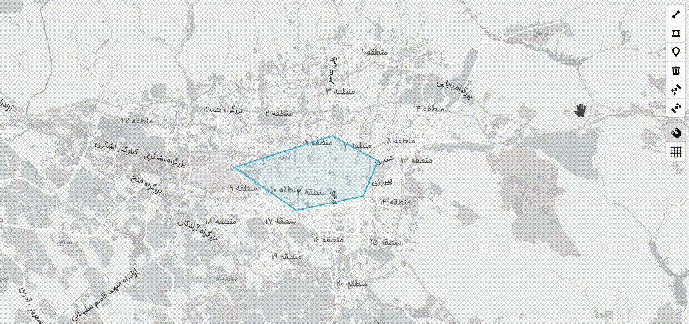

# Mapbox-GL Draw Snap Mode

[](https://www.npmjs.com/package/mapbox-gl-draw-snap-mode)

Custom mode for [Mapbox GL Draw](https://github.com/mapbox/mapbox-gl-draw) that adds snapping ability while drawing features.
It provides options to show guiding lines, control snapping sensibility, and whether to snap to midpoints on each segment.

## Demo

See a full example in the docs folder, or check at the [**Demo**](https://mhsattarian.github.io/mapbox-gl-draw-snap-mode).



## Install

```shell
npm i mapbox-gl-draw-snap-mode
```

or use CDN:

```html
<script src="https://unpkg.com/mapbox-gl-draw-snap-mode"></script>
```

## Usage

```js
import {
  SnapPolygonMode,
  SnapPointMode,
  SnapLineMode,
  SnapModeDrawStyles,
} from "mapbox-gl-draw-snap-mode";
// or global variable mapboxGlDrawSnapMode when using script tag

const draw = new MapboxDraw({
  modes: {
    ...MapboxDraw.modes,
    draw_point: SnapPointMode,
    draw_polygon: SnapPolygonMode,
    draw_line_string: SnapLineMode,
  },
  // Styling guides
  styles: SnapModeDrawStyles,
  userProperties: true,
  // Config snapping features
  snap: true,
  snapOptions: {
    snapPx: 15, // defaults to 15
    snapToMidPoints: true, // defaults to false
    snapVertexPriorityDistance: 0.0025, // defaults to 1.25
  },
  guides: false,
});

draw.changeMode("draw_polygon");
```

### options

#### `snapPx`

The min distnace (in pixels) where snapping to the line/segments would take effect.

#### `snapToMidPoints`

Controls whether to snap to line/segments midpoints (an imaginary point in the middle of each segment) or not.

#### `snapVertexPriorityDistance`

The min distance (in Kilometers) from each vertex, where snapping to that vertex would take priority over snapping to line/segments.

### Changing settings

Changing settings would take effect while snapping imidiately, so you can control snapping behaivior using `draw.options.snap`, like so:

```js
// turn snapping off
draw.options.snap = false;

// and back on
draw.options.snap = true;
```

> Snapping can also be disabled holding `Alt (Option)` key.

You can also create a [custom mapbox-gl draw toolbar](https://github.com/mapbox/mapbox-gl-draw/issues/874#issuecomment-470591089) to control this, take a look at the [example in the `docs` directory](/docs/index.html#L111).

## Developing and testing

Install dependencies, start the dev server:

```bash
npm install
npm start
```

## Publishing

To GitHub and NPM:

```
npm version (major|minor|patch)
git push --tags
git push
npm publish
```

## Acknowledgement

This project is heavily inspired by [this work](https://github.com/mapbox/mapbox-gl-draw/issues/865) of [@davidgilbertson](https://github.com/davidgilbertson) and [`leaflet-geoman` project](https://github.com/geoman-io/leaflet-geoman).
